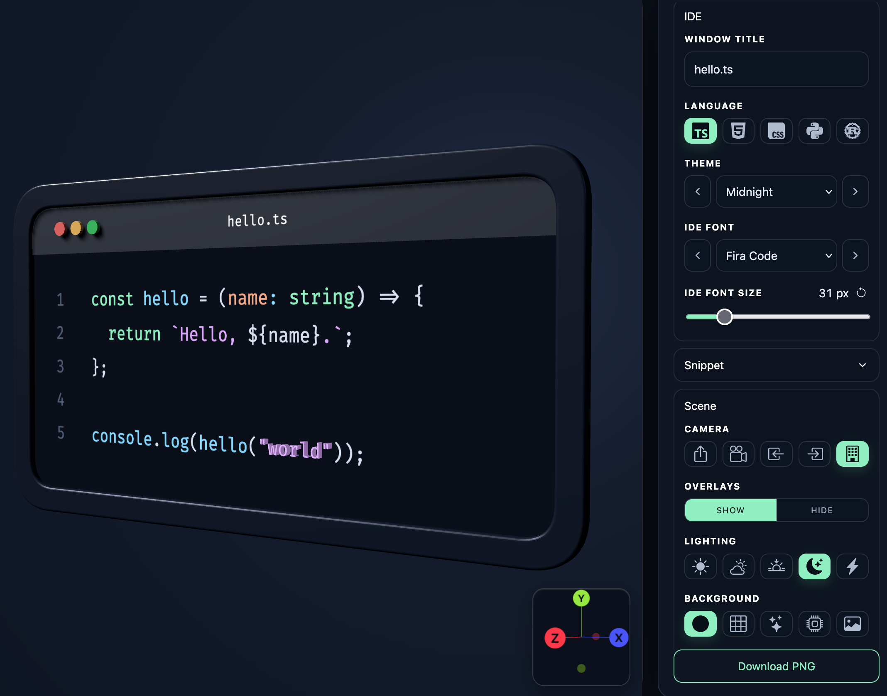

# codeFrame

Add some flair to your code snippet screenshots with this simple 3D scene in your browser.

Try it at: [albertomh.github.io/codeFrame](https://albertomh.github.io/codeFrame/)

    

---

## Run

1. Clone this repository.
2. Open `index.html` in a web browser.
3. Enter a code snippet in the sidebar and pick your preferred style etc.

## Develop

Prerequisites - the following must be available locally to develop `codeFrame`:

- [prek](https://prek.j178.dev/)

_Caveat contributor:_ this is a small, vibe-coded utility. It was quickly thrown together via Codex with little regard for maintainability, extensibility or code style.
